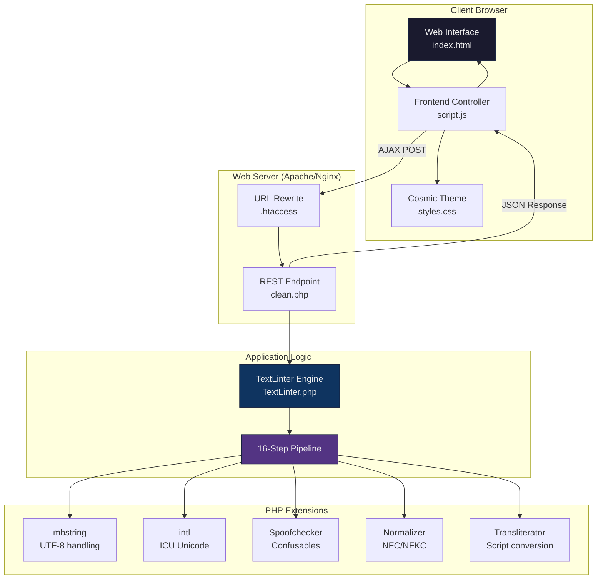
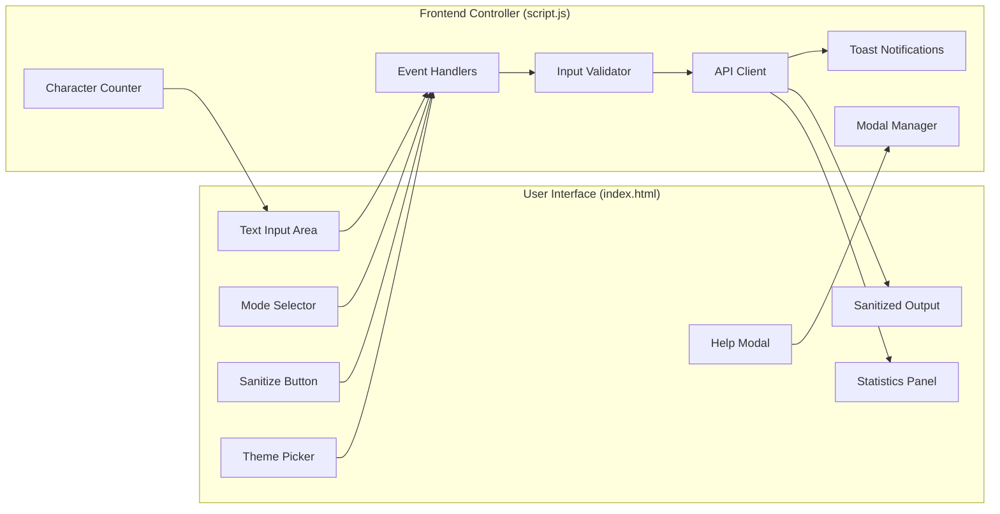
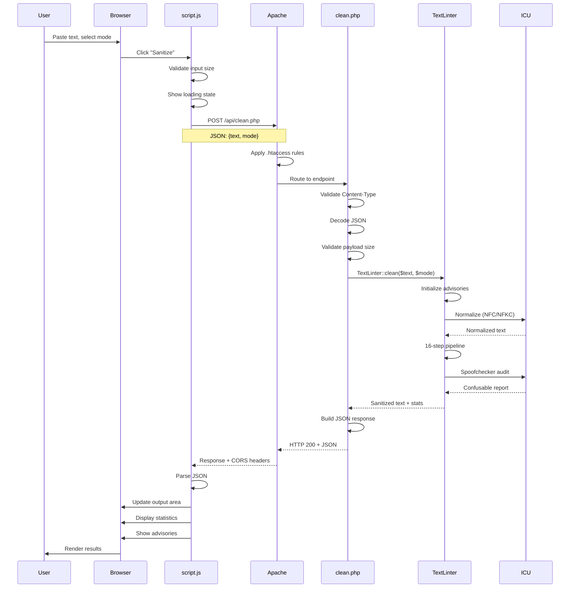
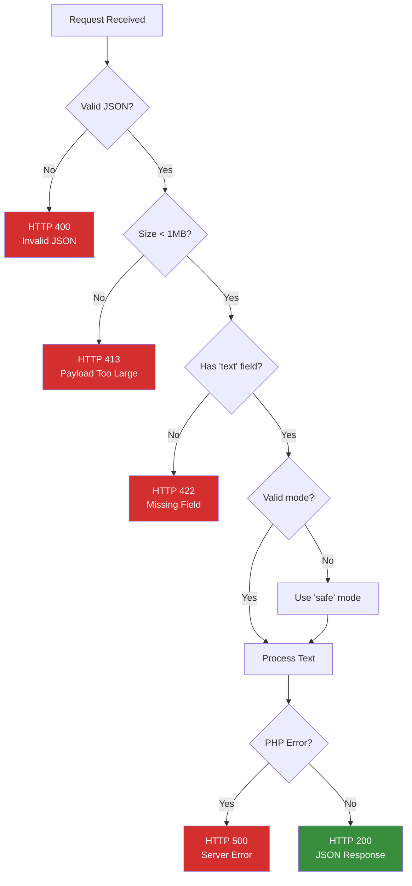
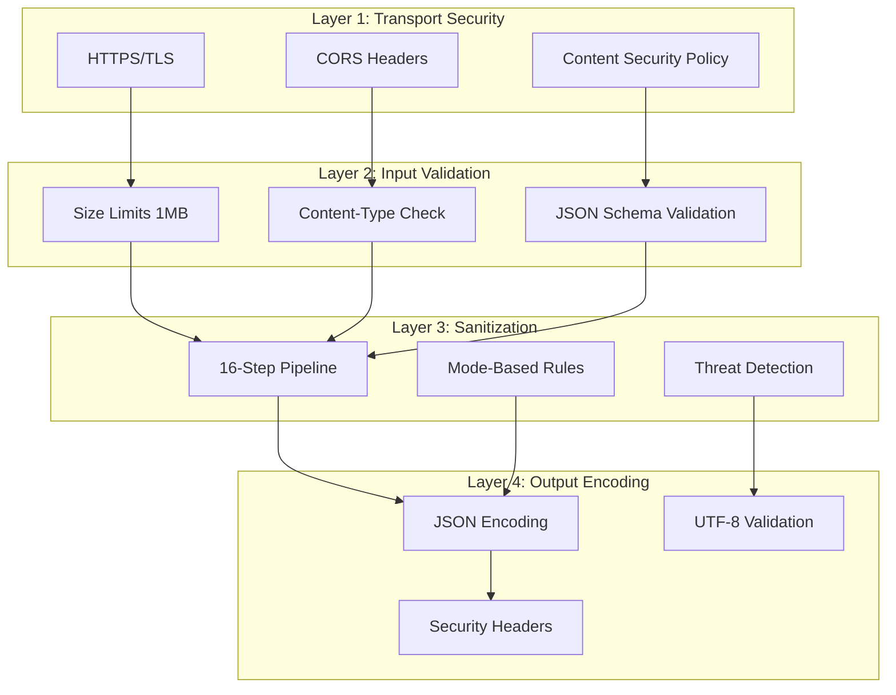
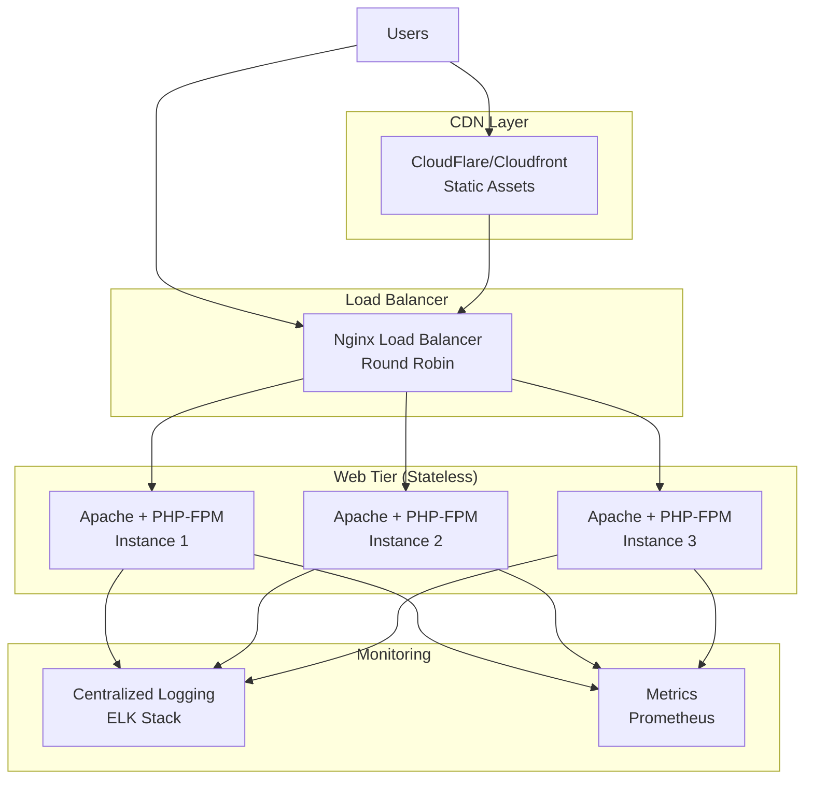

# Architecture Documentation

> Comprehensive guide to the Cosmic Text Linter system design, data flow, and component architecture.

## Table of Contents

- [System Overview](#system-overview)
- [Architecture Diagram](#architecture-diagram)
- [Component Architecture](#component-architecture)
- [Data Flow](#data-flow)
- [Sanitization Pipeline](#sanitization-pipeline)
- [Security Model](#security-model)
- [Deployment Architecture](#deployment-architecture)
- [Extension Points](#extension-points)

## System Overview

The Cosmic Text Linter is a **three-tier web application** designed for Unicode security sanitization:

1. **Presentation Layer**: HTML/CSS/JS frontend with retro cosmic UI
2. **Application Layer**: PHP-based RESTful API with Unicode processing
3. **Data Layer**: Stateless processing (no persistent storage required)

### Design Principles

- **Stateless Architecture**: No database or session management required
- **Progressive Enhancement**: Works without JavaScript (form fallback possible)
- **Security-First**: Input validation, output encoding, CSP-ready
- **Accessibility**: WCAG 2.1 AA compliant with ARIA labels
- **Performance**: Client-side rendering, server-side compute optimization
- **Extensibility**: Modular sanitization steps, pluggable modes

## Architecture Diagram



## Component Architecture

### 1. Frontend Components



#### Key Frontend Modules

| Module | Responsibility | Lines of Code |
|--------|---------------|---------------|
| `script.js` | Event handling, API communication, UI updates | 529 |
| `styles.css` | Theming, animations, responsive layout | 1,110 |
| `index.html` | Semantic structure, accessibility | 197 |

### 2. Backend Components

```mermaid
graph TD
    subgraph "API Layer (clean.php)"
        REQUEST[Request Handler]
        VALIDATE[Input Validation]
        RESPONSE[JSON Response]
        ERROR[Error Handler]
    end

    subgraph "Business Logic (TextLinter.php)"
        CLEAN[clean() Method]
        MODE_ROUTER[Mode Router]
        ADVISORY[Advisory Tracker]
        STATS[Statistics Collector]
    end

    subgraph "Sanitization Pipeline"
        S1[HTML Decode]
        S2[ASCII Control]
        S3[BiDi Defense]
        S4[Normalization]
        S5[Invisible Chars]
        S16[Final Cleanup]
    end

    REQUEST --> VALIDATE
    VALIDATE --> CLEAN
    CLEAN --> MODE_ROUTER
    MODE_ROUTER --> S1
    S1 --> S2
    S2 --> S3
    S3 --> S4
    S4 --> S5
    S5 -->|...12 more steps| S16
    S16 --> ADVISORY
    ADVISORY --> STATS
    STATS --> RESPONSE
    VALIDATE --> ERROR
    ERROR --> RESPONSE
```

#### Key Backend Modules

| Module | Responsibility | Lines of Code |
|--------|---------------|---------------|
| `TextLinter.php` | Core sanitization engine | 541 |
| `clean.php` | RESTful API endpoint | 103 |
| `.htaccess` | Routing, security headers, CORS | 47 |

## Data Flow

### Request/Response Cycle



### Error Handling Flow



## Sanitization Pipeline

### 16-Step Processing Pipeline

```mermaid
flowchart TD
    START([Input Text]) --> S1

    S1[Step 1: HTML Entity Decode<br/>&nbsp; → space] --> S2
    S2[Step 2: ASCII Control Removal<br/>Strip C0/C1 controls] --> S3
    S3[Step 3: BiDi Control Removal<br/>Remove LRE, RLE, PDF] --> S4
    S4[Step 4: Unicode Normalization<br/>NFC or NFKC+casefold] --> S5
    S5[Step 5: Invisible Character Removal<br/>ZWSP, ZWNJ, soft hyphen] --> S6
    S6[Step 6: Whitespace Normalization<br/>All spaces → ASCII 0x20] --> S7
    S7[Step 7: Digit Normalization<br/>Arabic-Indic → ASCII] --> S8
    S8[Step 8: Punctuation Normalization<br/>Smart quotes → straight] --> S9
    S9[Step 9: Combining Mark Cleanup<br/>Remove orphans, limit stacks] --> S10
    S10[Step 10: Formatting Removal<br/>Strip markdown/HTML] --> S11
    S11[Step 11: Noncharacter Removal<br/>U+FDD0-FDEF, U+FFFE/FFFF] --> S12
    S12[Step 12: Private Use Area<br/>Strip PUA (strict only)] --> S13
    S13[Step 13: TAG Block Removal<br/>Remove TAG chars] --> S14
    S14[Step 14: Homoglyph Normalization<br/>Cyrillic/Greek → Latin] --> S15
    S15[Step 15: Spoof Audit<br/>ICU Spoofchecker] --> S16
    S16[Step 16: Mirrored Punctuation<br/>Detect RTL issues] --> FINAL

    FINAL[Final Cleanup<br/>Paragraph detection<br/>Trailing newline] --> END([Sanitized Text])

    style START fill:#4caf50,color:#fff
    style END fill:#2196f3,color:#fff
    style S3 fill:#ff9800,color:#fff
    style S4 fill:#9c27b0,color:#fff
    style S5 fill:#ff9800,color:#fff
    style S14 fill:#ff9800,color:#fff
    style S15 fill:#f44336,color:#fff
```

### Mode-Specific Processing

```
┌─────────────────────────────────────────────────────────────┐
│                    Sanitization Pipeline                     │
├──────────────┬────────────────┬──────────────┬──────────────┤
│     Step     │      Safe      │  Aggressive  │    Strict    │
├──────────────┼────────────────┼──────────────┼──────────────┤
│ Normalization│ NFC            │ NFC          │ NFKC+casefold│
│ Invisibles   │ Remove         │ Remove       │ Remove       │
│ BiDi Controls│ Remove         │ Remove       │ Remove       │
│ Homoglyphs   │ Detect only    │ Normalize    │ Normalize    │
│ Digits       │ Preserve       │ Normalize    │ Normalize    │
│ Emoji        │ Preserve       │ Preserve     │ Preserve     │
│ RTL Marks    │ Preserve       │ Remove       │ Remove       │
│ PUA Chars    │ Preserve       │ Preserve     │ Remove       │
│ Nonchars     │ Preserve       │ Remove       │ Remove       │
│ Combining    │ Limit to 3     │ Limit to 2   │ Limit to 1   │
└──────────────┴────────────────┴──────────────┴──────────────┘
```

## Security Model

### Defense in Depth



### Threat Mitigation Matrix

| Threat | Detection | Mitigation | Mode |
|--------|-----------|------------|------|
| **Trojan Source** (CVE-2021-42574) | BiDi character scan | Remove LRE, RLE, PDF, LRO, RLO | All |
| **Homoglyph Spoofing** | ICU Spoofchecker | Normalize to Latin | Aggressive/Strict |
| **Zero-Width Steganography** | ZWSP/ZWNJ detection | Remove all invisibles | All |
| **TAG Injection** | TAG block scan (U+E0000-E007F) | Strip TAGs, preserve flags | All |
| **Zalgo Text** | Combining mark count | Limit to 1-3 per base | All |
| **Mixed Script Confusion** | Script property analysis | Detect, normalize to Latin | Aggressive/Strict |
| **Noncharacter Exploitation** | Range check (U+FDD0-FDEF) | Remove noncharacters | Aggressive/Strict |
| **PUA Covert Channels** | Private Use Area scan | Remove PUA chars | Strict only |

## Deployment Architecture

### Single-Server Deployment (cPanel)

```
┌─────────────────────────────────────────────────────────┐
│                    Apache Web Server                     │
├─────────────────────────────────────────────────────────┤
│  ┌────────────┐  ┌─────────────┐  ┌─────────────────┐ │
│  │  mod_rewrite│  │ mod_headers │  │   mod_deflate   │ │
│  └────────────┘  └─────────────┘  └─────────────────┘ │
├─────────────────────────────────────────────────────────┤
│                      .htaccess                          │
│  • URL Routing        • Security Headers                │
│  • CORS Config        • Compression                     │
│  • PHP Limits         • Asset Caching                   │
├─────────────────────────────────────────────────────────┤
│                      DocumentRoot                       │
│  /public_html/cosmic-text-linter/                      │
│    ├── index.html    (Static)                          │
│    ├── assets/       (Static, Cached)                  │
│    └── api/          (PHP-FPM)                         │
├─────────────────────────────────────────────────────────┤
│                     PHP 7.4+ FPM                        │
│  Extensions: mbstring, intl (ICU 70+)                   │
│  Memory: 128MB  |  Timeout: 30s  |  Upload: 2MB       │
└─────────────────────────────────────────────────────────┘
```

### High-Availability Deployment



## Extension Points

### 1. Adding New Sanitization Steps

```php
// In TextLinter.php, add to the pipeline
private static function customSanitizationStep($text, &$advisories) {
    // Your logic here
    if (/* condition */) {
        $advisories['custom_threat_detected'] = true;
    }
    return $modifiedText;
}

// Call in clean() method
$text = self::customSanitizationStep($text, $advisories);
```

### 2. Adding New Operation Modes

```php
// In clean() method, add new mode case
switch ($mode) {
    case 'safe':
    case 'aggressive':
    case 'strict':
        // Existing modes
        break;
    case 'custom':
        // Custom mode logic
        $normalizer = \Normalizer::NFC;
        $removeHomoglyphs = true;
        $removePUA = false;
        break;
}
```

### 3. Frontend Theme Extension

```javascript
// In script.js, add custom theme
const themes = {
    cosmic: '#00ffff',
    retro: '#ff00ff',
    custom: '#your-color'
};
```

### 4. API Response Customization

```php
// In clean.php, extend response object
$response = [
    'text' => $cleanedText,
    'stats' => $stats,
    'server' => $serverInfo,
    'custom' => [
        'timestamp' => time(),
        'request_id' => uniqid()
    ]
];
```

## Performance Characteristics

### Processing Time (Benchmarks)

| Input Size | Safe Mode | Aggressive | Strict | Notes |
|------------|-----------|------------|--------|-------|
| 1 KB | ~5ms | ~8ms | ~12ms | Typical short text |
| 10 KB | ~15ms | ~25ms | ~40ms | Typical paragraph |
| 100 KB | ~80ms | ~150ms | ~250ms | Long document |
| 1 MB | ~800ms | ~1.5s | ~2.5s | Maximum allowed |

### Resource Utilization

- **Memory**: ~2-5 MB per request (scales with input size)
- **CPU**: Single-threaded, CPU-bound (Unicode operations)
- **Network**: ~2-10 KB overhead (JSON, headers)
- **Disk I/O**: None (stateless processing)

### Scaling Recommendations

- **Horizontal Scaling**: Add web server instances (stateless)
- **Caching**: Cache static assets (CSS/JS) with long TTL
- **CDN**: Serve assets from edge locations
- **Rate Limiting**: 100 requests/minute per IP recommended
- **Connection Pooling**: Not applicable (stateless)

## Technology Decisions

### Why PHP?

- **Ubiquitous Hosting**: Available on 99% of shared hosting (cPanel)
- **ICU Integration**: Native `intl` extension with full Unicode support
- **Mature Ecosystem**: Well-tested libraries (Normalizer, Spoofchecker)
- **Low Overhead**: No framework bloat, minimal dependencies

### Why No Database?

- **Stateless Design**: Each request is independent
- **Simplicity**: No schema migrations, backups, or replication
- **Performance**: Eliminates DB query overhead
- **Scalability**: Horizontal scaling without state synchronization

### Why Vanilla JavaScript?

- **Zero Build Step**: No npm, webpack, or transpilation
- **Browser Native**: ES6+ supported in all modern browsers
- **Performance**: No framework overhead (~50 KB smaller)
- **Maintainability**: Standard APIs, no framework churn

## Conclusion

The Cosmic Text Linter architecture prioritizes:

1. **Simplicity**: Minimal dependencies, easy deployment
2. **Security**: Defense-in-depth with multiple validation layers
3. **Performance**: Stateless design enables horizontal scaling
4. **Maintainability**: Clear separation of concerns, well-documented code
5. **Accessibility**: Progressive enhancement, ARIA compliance

For implementation details, see [DEVELOPER_GUIDE.md](DEVELOPER_GUIDE.md).
