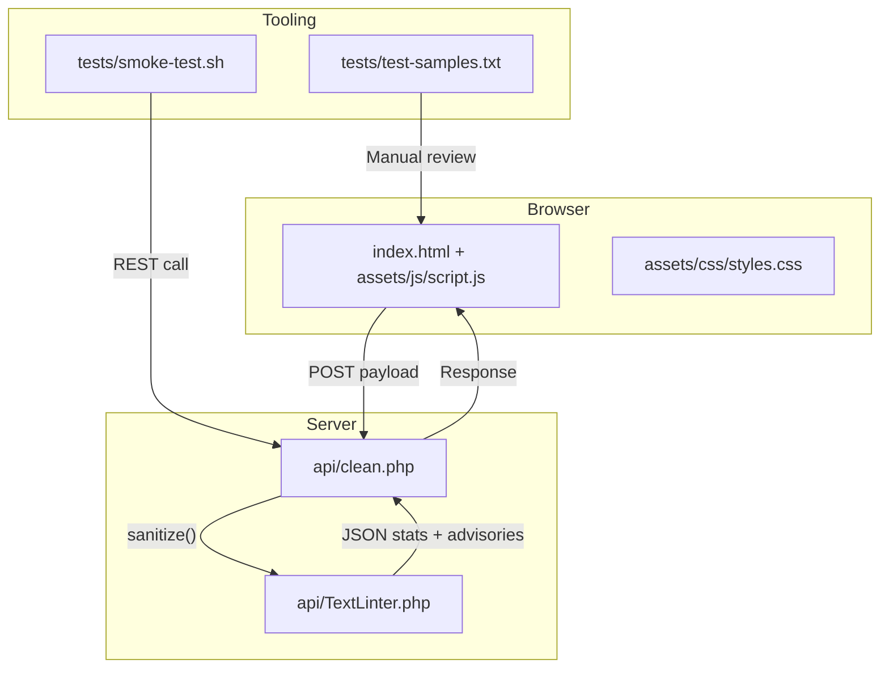

# Architecture Guide

This guide explains how the browser UI, PHP API, and sanitization engine collaborate to transform untrusted text into safe output while preserving observability. Use it to orient new contributors and to evaluate the impact of architectural changes.

## High-Level Topology



- **Browser** – Collects input, renders results, and exposes diff tooling.
- **Server** – Validates requests, runs the 18-pass Unicode pipeline, and returns typed metadata.
- **Tooling** – Provides regression tests and sample payloads for smoke testing.

## Request Lifecycle Detail

```
Operator → Browser fetch() → clean.php (validation) → TextLinter::clean → JSON response
```

1. **User interaction** – `assets/js/script.js` listens for form submit or keyboard shortcuts and serializes `text`, `mode`, and UI state.
2. **Transport** – Requests go to `/api/clean.php` via HTTPS POST. The UI sets `Content-Type: application/json` and includes CSRF-safe headers for hosted deployments.
3. **Validation** – `clean.php` enforces:
   - HTTP method check (`POST` only)
   - Payload size (< 1 MB)
   - Required fields (`text`, `mode`)
   - PHP extension availability (`intl`, `mbstring`)
   - Cache and CORS headers (defaults to permissive; adjust in production)
4. **Sanitization** – `TextLinter::clean` orchestrates the passes listed below, building an associative array with sanitized text, statistics, advisories, and server metadata.
5. **Response** – `clean.php` encodes the result as JSON, sets HTTP 200 or error status, and the UI updates diff/results panels.

## Sanitization Pipeline Passes

The engine is organized into discrete methods so that contributors can extend or reorder steps with confidence.

| Order | Method | Key Inputs | Output | Risk Mitigated |
| --- | --- | --- | --- | --- |
| 01 | `decodeEntities` | Raw input | Decoded string | Obfuscated HTML entity payloads |
| 02 | `stripControls` | Decoded string | Control-free text | Hidden ASCII control characters |
| 03 | `stripBidiControls` | Control-free text | Direction-stable text | Trojan Source, BiDi reordering |
| 04 | `nfcNormalize` / `nfkcCasefold` | Mode | Canonically normalized string | Duplicate glyph representations |
| 05 | `stripInvisibles` | Normalized string | Text without zero-width or watermark chars | Hidden watermarks, separators |
| 06 | `normalizeWhitespace` | Mode | Normalized spacing | Layout manipulation |
| 07 | `asciiDigits` | Mode | ASCII digits | Digit spoofing |
| 08 | `normalizePunctuation` | Mode | Standardized punctuation | Confusable punctuation |
| 09 | `cleanOrphanCombining` | Text | Valid grapheme clusters | Zalgo/orphan combining marks |
| 10 | `stripFormatting` | Mode | Plain text | Malicious markdown formatting |
| 11 | `stripNoncharacters` | Text | Interchange-safe text | Non-interchange code points |
| 12 | `stripPrivateUse` | Mode | PUA-free text | Steganography via private-use planes |
| 13 | `stripTagBlock` | Text | Text without deprecated tag chars | Steganography, control abuse |
| 14 | `normalizeHomoglyphs` | Mode | ASCII-safe identifiers | Homoglyph spoofing |
| 15 | `spoofAudit` | ICU `Spoofchecker` | Advisory flags | Mixed-script confusion |
| 16 | `detectMirroredPunctuation` | Text | Advisory flags | Mirrored bracket obfuscation |
| 17 | `stripInvisibles` (pass 2) | Text | Clean text | Residual zero-width characters |
| 18 | `finalCleanup` | Text | Trimmed, LF-normalized output | Consistent output formatting |

> **Tip:** Keep passes idempotent so repeated calls produce the same output—aiding fuzz testing and UI retries.

## Data Contracts

### Request Schema

```json
{
  "text": "<string>",
  "mode": "safe" | "aggressive" | "strict"
}
```

### Response Schema (success)

```json
{
  "text": "<sanitized string>",
  "stats": {
    "original_length": <int>,
    "final_length": <int>,
    "characters_removed": <int>,
    "mode": "safe" | "aggressive" | "strict",
    "invisibles_removed": <int>,
    "homoglyphs_normalized": <int>,
    "digits_normalized": <int>,
    "advisories": {
      "had_bidi_controls": <bool>,
      "had_mixed_scripts": <bool>,
      "had_default_ignorables": <bool>,
      "had_tag_chars": <bool>,
      "had_orphan_combining": <bool>,
      "confusable_suspected": <bool>,
      "had_html_entities": <bool>,
      "had_ascii_controls": <bool>,
      "had_noncharacters": <bool>,
      "had_private_use": <bool>,
      "had_mirrored_punctuation": <bool>,
      "had_non_ascii_digits": <bool>
    }
  },
  "server": {
    "version": "<semver>",
    "unicode_version": "<icu version>",
    "extensions": {
      "intl": <bool>,
      "mbstring": <bool>,
      "spoofchecker": <bool>
    }
  }
}
```

### Response Schema (error)

```json
{
  "error": {
    "code": "request_too_large" | "invalid_payload" | "unsupported_mode" | "server_error",
    "message": "<human readable explanation>"
  }
}
```

## Front-End Responsibilities

- **Form controller** – Collects input, toggles loading state, and protects against multiple submissions.
- **Diff view** – Renders sanitized vs original text using a light-weight LCS implementation (`assets/js/script.js`).
- **Advisory badges** – Maps each advisory flag to UI badges with accessible tooltips.
- **Clipboard helpers** – Provide sanitized copy functionality without exposing innerHTML to untrusted content.

## Extension Points

| Area | Strategy |
| --- | --- |
| Additional advisories | Add detection inside `TextLinter` and append to the `stats['advisories']` map. Update `docs/api.md` and UI labels accordingly. |
| Custom response metadata | Extend `$result['server']` in `clean.php` to include deployment identifiers or rate-limit hints. |
| UI modules | Add new panels in `index.html` and corresponding CSS/JS modules; expose data through the existing JSON schema. |

## Testing & Observability

- Run `tests/smoke-test.sh` against staging deployments after PHP upgrades or pipeline changes.
- Add PHPUnit tests for new sanitization passes to ensure idempotency and coverage of edge cases.
- Enable access logs or application telemetry to monitor payload sizes, advisory frequency, and error rates.

Keeping architectural documentation in sync with code changes helps ensure security regressions are caught early and new contributors understand where to plug in.
