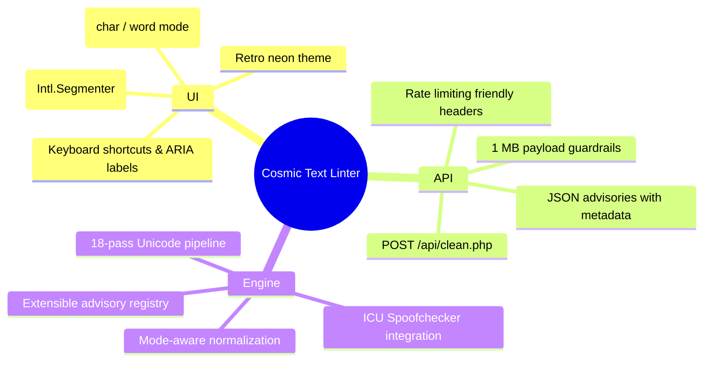

# Project Overview

Cosmic Text Linter is a defensive Unicode hygiene service that detects and neutralizes invisible control characters, spoofing attempts, and other adversarial glyph tricks while keeping legitimate multilingual text intact. The project ships as a neon, retro-inspired single page app backed by a PHP API so analysts, CI pipelines, and bot integrations can all sanitize input with the same deterministic pipeline.

## What Problem Does It Solve?

Modern text workflows regularly ingest untrusted payloads—pull request diffs, forum submissions, paste bins, and automated imports. Unicode makes it trivial to embed harmful or confusing characters (BiDi overrides, zero-width joiners, homoglyphs) that humans cannot see but compilers, interpreters, or reviewers still obey. Cosmic Text Linter provides:

- **Early detection** of Trojan Source style attacks and homoglyph spoofing before they land in production systems.
- **Automatic remediation** through a configurable sanitization pipeline tuned for security operations, multilingual support, or extremely strict ASCII-only environments.
- **Audit-ready reports** that explain exactly which advisories triggered so reviewers can accept or reject the sanitized text with confidence.

## Primary Personas

| Persona | Scenario | Value Delivered |
| --- | --- | --- |
| Security engineer | Scanning source code patches for BiDi and invisible characters. | Receives a normalized diff plus explicit advisories to highlight dangerous glyphs. |
| Content moderator | Reviewing multilingual forum posts with potential watermarking. | Keeps emoji and punctuation intact while stripping watermark controls. |
| CI/CD automation | Normalizing commit messages or infrastructure definitions. | Calls the REST API to sanitize payloads before pipelines persist them. |

## Feature Matrix



## Example Workflow

1. Analyst pastes raw text into **Raw Input**.
2. The UI serializes `{ text, mode }` and performs a `fetch('/api/clean.php')` POST.
3. `clean.php` validates headers, payload size, and mode before delegating to `TextLinter::clean`.
4. The sanitization engine runs its 18 passes, producing sanitized text plus advisory flags.
5. The browser renders updated counters, advisories, and diff output so the analyst can copy safe content or export metadata.

### ASCII Flow (end-to-end)

```
[Operator] --paste--> [Browser UI] --POST--> [api/clean.php]
      ^                                         |
      |                                         v
[Copy sanitized text] <---JSON & advisories--- [TextLinter]
```

## Sanitization Modes at a Glance

| Mode | Intended Use Case | Key Behaviors |
| --- | --- | --- |
| Safe | Balanced multilingual workflows. | Preserves emoji, markdown syntax, RTL marks; strips harmful controls and watermark characters. |
| Aggressive | Latin-centric pipelines (log ingestion, ASCII systems). | Removes most non-ASCII punctuation and harmonizes homoglyphs. |
| Strict | Maximum defense for compiler feeds or IaC. | Applies NFKC case folding, removes private-use and digit variants, enforces ASCII digit normalization. |

> The UI defaults to **Safe** mode so operators start with maximum readability and can escalate if advisories remain.

## Integration Touchpoints

- **Web UI** – Manual analysts interact through `index.html`, `assets/css/styles.css`, and `assets/js/script.js`.
- **REST API** – Automation calls `POST /api/clean.php` with JSON or form data; responses include version metadata for auditing.
- **CLI / Tests** – Smoke tests and sample payloads live under `tests/` for regression safety.

## Documentation Map

| Guide | Summary |
| --- | --- |
| [Architecture Guide](architecture.md) | Deep dive into components, data flow, and the sanitization pipeline. |
| [API Reference](api.md) | Request/response schema, error catalog, and integration recipes. |
| [Implementation Notes](implementation.md) | Internal PHP and JavaScript design decisions, extension points, and testing guidance. |
| [Version Branch Playbook](version-branches.md) | Maintainer checklist for publishing documentation variants from git branches. |

Keep this overview current whenever UI flows, advisories, or personas evolve so that new contributors grasp the "why" before diving into code.
